_This repository represents an example of using a Chainlink product or service. It is provided to help you understand how to interact with Chainlink’s systems so that you can integrate them into your own. This template is provided "AS IS" without warranties of any kind, has not been audited, and may be missing key checks or error handling to make the usage of the product more clear. Take everything in this repository as an example and not something to be copy pasted into a production ready service._


<div align="center" style="margin: 30px; width: 100%; display: flex; justify-content: center; align-items: center;">
<a href="https://cct.wiki/">
  
</a>
</div>

# Building with the Cross Chain Token (CCT) Standard
> _Demonstrating how to use Chainlink Cross-Chain Interoperobility Protocol (CCIP) leveraging the Cross Chain Token (CCT) Standard to send a token from Ethereum Sepolia to Base Sepolia. This includes the creation of a CCT on the source chain, and the redemption of that CCT on the destination chain and management of the CCT via the sdk and token manager._

## Overview
This repository provides a step-by-step guide for implementing the Cross Chain Token (CCT) Standard using Chainlink's Cross-Chain Interoperability Protocol (CCIP). The implementation demonstrates token deployment and transfer between Ethereum Sepolia and Base Sepolia networks, including token creation, pool management, and cross-chain transfers.

## Table of Contents

1. **Initial Setup**
   - [Install Dependencies](#step-1--install-dependencies)
   - [Setup Environment](#step-2--setup-environment)
   - [Create Wallet](#step-3--create-wallet)

2. **Testing**
   - [Test Contracts](#step-4--test-contracts)

3. **Token Deployment**
   - [Deploy Tokens](#step-5--deploy-tokens)
     - [Ethereum Sepolia Implementation](./receipts/transactions/tokenEthSepolia.md)
     - [Base Sepolia Implementation](./receipts/transactions/tokenBaseSepolia.md)

4. **Pool Management**
   - [Deploy Pools](#step-6--deploy-pools)
     - [Ethereum Sepolia Pool](./receipts/transactions/poolEthSepolia.md)
     - [Base Sepolia Pool](./receipts/transactions/poolBaseSepolia.md)

5. **Administrative Setup**
   - [Claim Admin Role](#step-7--claim-admin-role)  
   - [Accept Admin Role](#step-8--accept-admin-role)
   - [Set Pool](#step-9--set-pool)
   - [Apply Chain](#step-10--apply-chain)

6. **Token Operations**
   - [Mint Tokens](#step-11--mint-tokens)
   - [Transfer Tokens](#step-12--transfer-tokens)

## Key Components

1. **Environment Setup**
   - Configuration of environment variables
   - Wallet creation and management
   - Network RPC endpoints setup

2. **Smart Contracts**
   - Token contracts
   - Pool contracts
   - Management contracts
   - Transfer contracts

3. **Network Support**
   - Ethereum Sepolia testnet
   - Base Sepolia testnet

4. **Administrative Functions**
   - Role management
   - Pool configuration
   - Chain setup
   - Token minting and transfer capabilities

> #### Each step includes detailed commands and verification steps, with transaction receipts stored in the `./receipts/transactions/` directory and visual confirmations in `./receipts/screenshots/`.


# Step 1 | Install Dependencies

```bash
yarn && make
```

# Step 2 | Setup Environment

Run the command below, then update the .env `PRIVATE_KEY` and `ETHERSCAN_API_KEY` variables.

```bash
if [ -f .env ]; then
    echo "We will use the .env your have already created."
    else
    if [ -z "${DOTENV}" ]; then
        echo "Creating and setting .env"
        cp .env.example .env && source .env
        echo "Set your PRIVATE_KEY and ETHERSCAN_API_KEY in .env"
    fi
fi
```

# Step 3 | Create Wallet

To create a new wallet that is stored in a keystore, issue the following command, which will prompt you to secure the private key with a password.

```shell
# Grabs the PRIVATE_KEY from the .env file.
PRIVATE_KEY=$(grep PRIVATE_KEY .env | cut -d '=' -f2)

if [ -f keystore/secret ]; then
    echo "Found keystore in workspace"
    else
    if [ -z "${DOTENV}" ]; then
        echo "Creating and setting keystore"
        mkdir keystore
        cast wallet import --private-key $PRIVATE_KEY -k keystore secret
        echo "keystore/secret created"
    fi
fi
```

For ease use of the keystore we already configured a environment variable called `KEYSTORE` pointing to the `keystore` file in the working directory.

You can use the wallet stored in the keystore by adding the `--keystore` flag instead of the `--private-key` flag. Run the command below to confirm your wallet address is stored accurately.

```bash
KEYSTORE=$(grep KEYSTORE .env | cut -d '=' -f2)

cast wallet address --keystore $KEYSTORE
export WALLET_ADDRESS=$(cast wallet address --keystore $KEYSTORE)

```
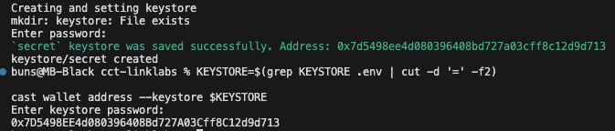

# Step 4 | [Test Contracts](./test/BnM.t.sol)

Before we proceed with deployment, it is best practice to run tests, which can be executed as follows:

```bash
forge test -vvv
```

### Test Output
```plaintext
Ran 1 test for test/BnM.t.sol:BurnMintPoolFork
[PASS] test_cctDeployment() (gas: 7404858)
Logs:
  [1] mockERC20TokenEthSepolia deployed
  [2] mockERC20TokenBaseSepolia deployed
  [3] burnMintTokenPoolEthSepolia deployed
  [4] burnMintTokenPoolBaseSepolia deployed
  [5] mint and burn roles granted to burnMintTokenPoolEthSepolia
  [6] mint and burn roles granted to burnMintTokenPoolBaseSepolia
  [7] Claim Admin role on Ethereum Sepolia
  [8] Claim Admin role on Base Sepolia
  [9] Accept Admin role on Ethereum Sepolia
  [10] Accept Admin role on Base Sepolia
  [11] Link token to pool on Ethereum Sepolia
  [12] Link token to pool on Base Sepolia
  [13] Configured Token Pool on Ethereum Sepolia
  [14] Configured Token Pool on Base Sepolia
  [15] minted and sent tokens from Ethereum Sepolia to Base Sepolia
  [16] received tokens in Base Sepolia

Suite result: ok. 1 passed; 0 failed; 0 skipped; finished in 9.56s (7.21s CPU time)
```

# Step 5 | [Deploy Tokens](./script/deploy/DeployTokens.s.sol)
In order to interact with our contracts, we first need to deploy them, which is simplified in the [`script/deploy`](./script/deploy) smart contracts, so let's deploy each contract applying the deployment script for each of the following commands.

### 5 | Deploy Tokens | [Ethereum Sepolia](./receipts/transactions/tokenEthSepolia.md)

```bash
ETH_SEPOLIA_RPC=$(grep ETH_SEPOLIA_RPC .env | cut -d '=' -f2)
WALLET_ADDRESS=$(grep WALLET_ADDRESS .env | cut -d '=' -f2)
PRIVATE_KEY=$(grep PRIVATE_KEY .env | cut -d '=' -f2)

if ! [ -f .env ]; then
    echo "Missing necessary environment variables for deployment" 
    echo "Please set the following environment variables:"
    echo "ETH_SEPOLIA_RPC, KEYSTORE, and WALLET_ADDRESS"
else 
    if [ -z "${DOTENV}" ]; then
        echo "Deploying Token on Sepolia"
        rm -rf keystore
        cast wallet import --private-key $PRIVATE_KEY -k keystore secret
        forge script ./script/deploy/DeployTokens.s.sol:DeployToken -vvv --broadcast --rpc-url $ETH_SEPOLIA_RPC --sender $WALLET_ADDRESS --private-key $PRIVATE_KEY
        echo "Token deployed on Sepolia"
    fi
fi
```
<!-- 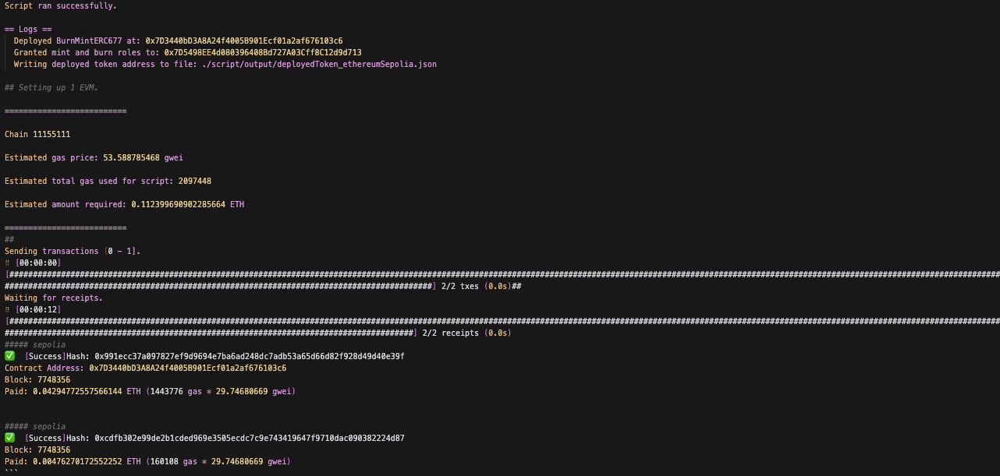 -->

### 5 | Deploy Tokens | [Base Sepolia](./receipts/transactions/tokenBaseSepolia.md)

```bash
BASE_SEPOLIA_RPC=$(grep BASE_SEPOLIA_RPC .env | cut -d '=' -f2)
WALLET_ADDRESS=$(grep WALLET_ADDRESS .env | cut -d '=' -f2)
PRIVATE_KEY=$(grep PRIVATE_KEY .env | cut -d '=' -f2)

if ! [ -f .env ]; then
    echo "Missing necessary environment variables for deployment" 
    echo "Please set the following environment variables:"
    echo "BASE_SEPOLIA_RPC, KEYSTORE, and WALLET_ADDRESS"
else 
    if [ -z "${DOTENV}" ]; then
        echo "Deploying Token on Base Sepolia"
        rm -rf keystore
        cast wallet import --private-key $PRIVATE_KEY -k keystore secret
        forge script ./script/deploy/DeployTokens.s.sol:DeployToken -vvv --broadcast --rpc-url $BASE_SEPOLIA_RPC --sender $WALLET_ADDRESS --private-key $PRIVATE_KEY
        echo "Token deployed on Base Sepolia"
    fi
fi
```
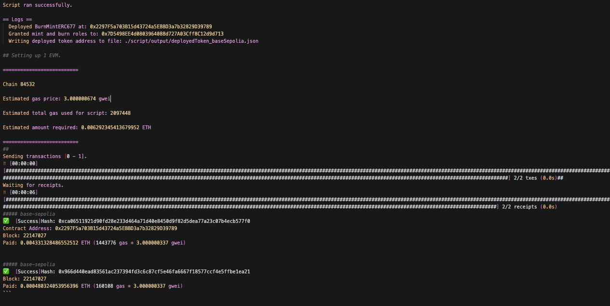

# Step 6 | Deploy Pools

### Deploy Pools | [Ethereum Sepolia](./receipts/transactions/poolEthSepolia.md)
```bash
ETH_SEPOLIA_RPC=$(grep ETH_SEPOLIA_RPC .env | cut -d '=' -f2)
WALLET_ADDRESS=$(grep WALLET_ADDRESS .env | cut -d '=' -f2)
PRIVATE_KEY=$(grep PRIVATE_KEY .env | cut -d '=' -f2)
forge script ./script/deploy/DeployPool.s.sol:DeployPool -vvv --broadcast --rpc-url $ETH_SEPOLIA_RPC --sender $WALLET_ADDRESS --private-key $PRIVATE_KEY
```
<!-- 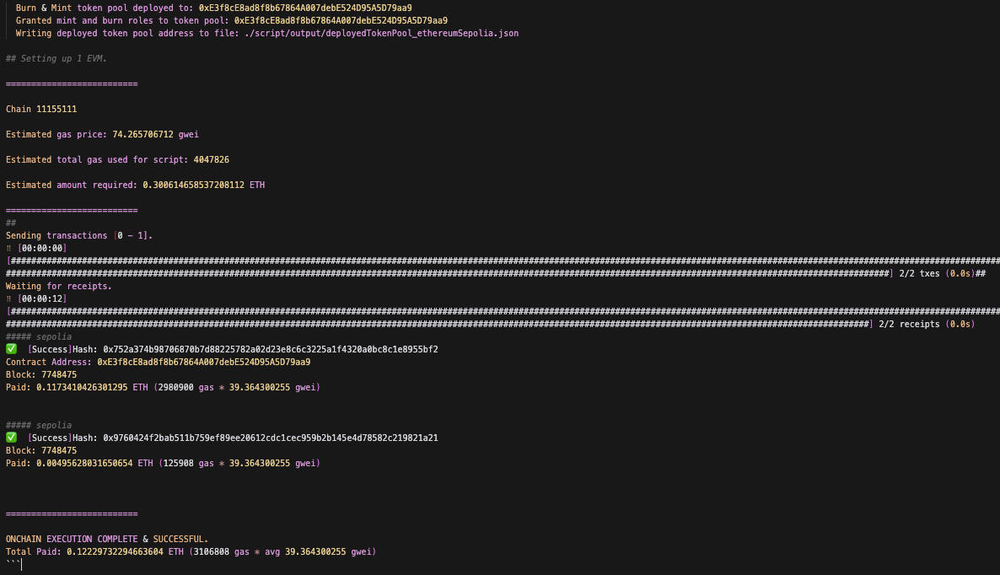 -->

### Deploy Pools | [Base Sepolia](./receipts/transactions/poolBaseSepolia.md)
```bash
BASE_SEPOLIA_RPC=$(grep BASE_SEPOLIA_RPC .env | cut -d '=' -f2)
WALLET_ADDRESS=$(grep WALLET_ADDRESS .env | cut -d '=' -f2)
PRIVATE_KEY=$(grep PRIVATE_KEY .env | cut -d '=' -f2)
forge script ./script/deploy/DeployPool.s.sol:DeployPool -vvv --broadcast --rpc-url $BASE_SEPOLIA_RPC --sender $WALLET_ADDRESS --private-key $PRIVATE_KEY
```
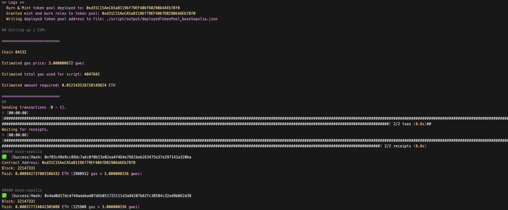


# Step 7 | [Claim Admin Role](./script/manage/ClaimAdmin.s.sol)

### 7 | Claim Admin Role | [Ethereum Sepolia](./receipts/transactions/claimAdminEthSepolia.md)
```bash
ETH_SEPOLIA_RPC=$(grep ETH_SEPOLIA_RPC .env | cut -d '=' -f2)
WALLET_ADDRESS=$(grep WALLET_ADDRESS .env | cut -d '=' -f2)
PRIVATE_KEY=$(grep PRIVATE_KEY .env | cut -d '=' -f2)
forge script ./script/admin/ClaimAdmin.s.sol:ClaimAdmin --rpc-url $ETH_SEPOLIA_RPC --broadcast --sender $WALLET_ADDRESS --private-key $PRIVATE_KEY
```

### 7 | Claim Admin Role | [Base Sepolia](./receipts/transactions/claimAdminBaseSepolia.md)

```bash
BASE_SEPOLIA_RPC=$(grep BASE_SEPOLIA_RPC .env | cut -d '=' -f2)
WALLET_ADDRESS=$(grep WALLET_ADDRESS .env | cut -d '=' -f2)
PRIVATE_KEY=$(grep PRIVATE_KEY .env | cut -d '=' -f2)
forge script ./script/admin/ClaimAdmin.s.sol:ClaimAdmin --rpc-url $BASE_SEPOLIA_RPC --broadcast --sender $WALLET_ADDRESS --private-key $PRIVATE_KEY
```
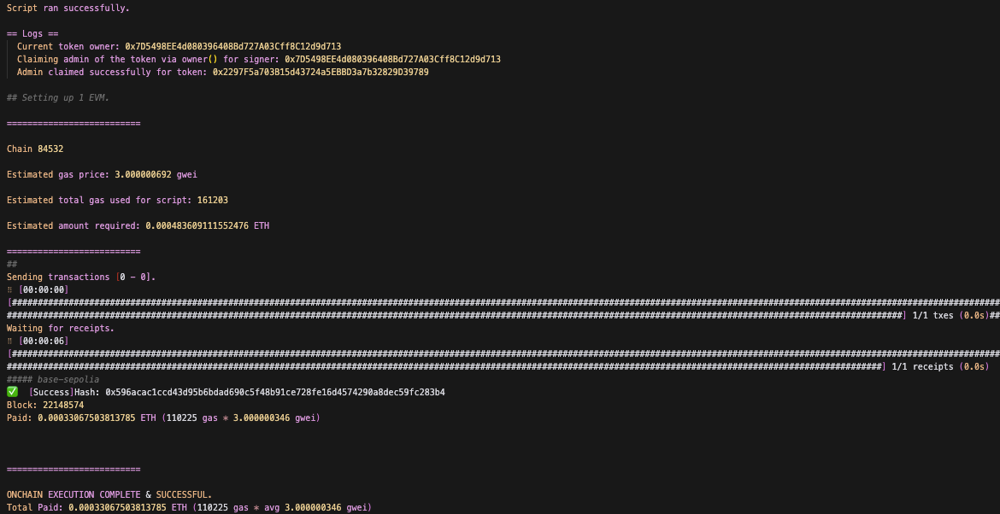

# Step 8 | [Accept Admin Role](./script/admin/AcceptAdmin.s.sol)

### 8 | Accept Admin Role | [Ethereum Sepolia](./receipts/transactions/acceptAdminEthSepolia.md)

```bash
ETH_SEPOLIA_RPC=$(grep ETH_SEPOLIA_RPC .env | cut -d '=' -f2)
WALLET_ADDRESS=$(grep WALLET_ADDRESS .env | cut -d '=' -f2)
PRIVATE_KEY=$(grep PRIVATE_KEY .env | cut -d '=' -f2)
forge script ./script/admin/AcceptAdmin.s.sol:AcceptAdmin --rpc-url $ETH_SEPOLIA_RPC --broadcast --sender $WALLET_ADDRESS --private-key $PRIVATE_KEY
```

### 8 | Accept Admin Role | [Base Sepolia](./receipts/transactions/acceptAdminBaseSepolia.md)
```bash
BASE_SEPOLIA_RPC=$(grep BASE_SEPOLIA_RPC .env | cut -d '=' -f2)
WALLET_ADDRESS=$(grep WALLET_ADDRESS .env | cut -d '=' -f2)
PRIVATE_KEY=$(grep PRIVATE_KEY .env | cut -d '=' -f2)
forge script ./script/admin/AcceptAdmin.s.sol:AcceptAdmin --rpc-url $BASE_SEPOLIA_RPC --broadcast --sender $WALLET_ADDRESS --private-key $PRIVATE_KEY
```
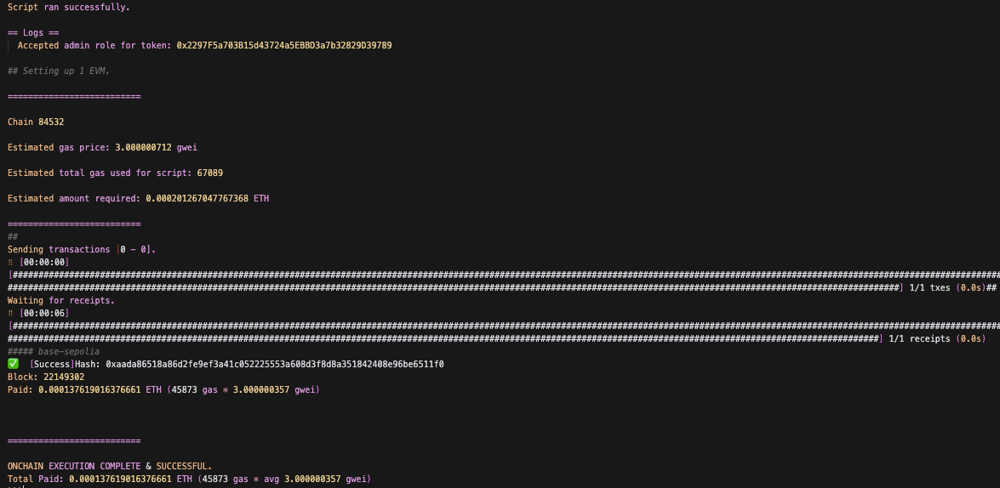

# Step 9 | [Set Pool](./script/manage/SetPool.s.sol)

### 9 | Set Pool | [Ethereum Sepolia](./receipts/transactions/setPoolEthSepolia.md)
```bash
ETH_SEPOLIA_RPC=$(grep ETH_SEPOLIA_RPC .env | cut -d '=' -f2)
WALLET_ADDRESS=$(grep WALLET_ADDRESS .env | cut -d '=' -f2)
PRIVATE_KEY=$(grep PRIVATE_KEY .env | cut -d '=' -f2)
forge script ./script/manage/SetPool.s.sol:SetPool --rpc-url $ETH_SEPOLIA_RPC --broadcast --sender $WALLET_ADDRESS --private-key $PRIVATE_KEY
```

### 9 | Set Pool | [Base Sepolia](./receipts/transactions/setPoolBaseSepolia.md)

```bash
BASE_SEPOLIA_RPC=$(grep BASE_SEPOLIA_RPC .env | cut -d '=' -f2)
WALLET_ADDRESS=$(grep WALLET_ADDRESS .env | cut -d '=' -f2)
PRIVATE_KEY=$(grep PRIVATE_KEY .env | cut -d '=' -f2)
forge script ./script/manage/SetPool.s.sol:SetPool --rpc-url $BASE_SEPOLIA_RPC --broadcast --sender $WALLET_ADDRESS --private-key $PRIVATE_KEY
```
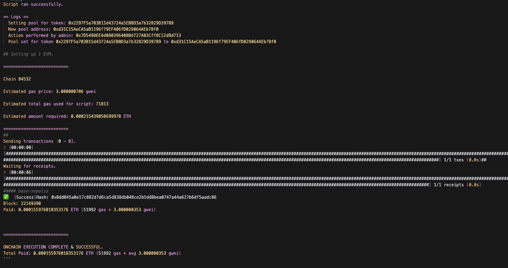

# Step 10 | [Apply Chain](./script/manage/ApplyChain.s.sol)

### 10 | Apply Chain | [Ethereum Sepolia](./receipts/transactions/applyChainEthSepolia.md)
```bash
ETH_SEPOLIA_RPC=$(grep ETH_SEPOLIA_RPC .env | cut -d '=' -f2)
WALLET_ADDRESS=$(grep WALLET_ADDRESS .env | cut -d '=' -f2)
PRIVATE_KEY=$(grep PRIVATE_KEY .env | cut -d '=' -f2)
forge script ./script/manage/ApplyChain.s.sol:ApplyChain --rpc-url $ETH_SEPOLIA_RPC --broadcast --sender $WALLET_ADDRESS --private-key $PRIVATE_KEY
```

### 10 | Apply Chain | [Base Sepolia](./receipts/transactions/applyChainBaseSepolia.md)
```bash
BASE_SEPOLIA_RPC=$(grep BASE_SEPOLIA_RPC .env | cut -d '=' -f2)
WALLET_ADDRESS=$(grep WALLET_ADDRESS .env | cut -d '=' -f2)
PRIVATE_KEY=$(grep PRIVATE_KEY .env | cut -d '=' -f2)
forge script ./script/manage/ApplyChain.s.sol:ApplyChain --rpc-url $BASE_SEPOLIA_RPC --broadcast --sender $WALLET_ADDRESS --private-key $PRIVATE_KEY
```
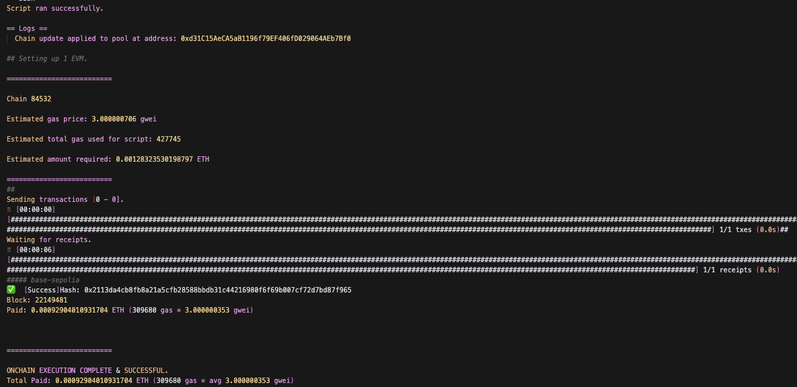

# Step 11 | [Mint Tokens](./script/mint/MintTokens.s.sol)

### 11 | Mint Tokens | [Ethereum Sepolia](./receipts/transactions/mintEthSepolia.md)
```bash
ETH_SEPOLIA_RPC=$(grep ETH_SEPOLIA_RPC .env | cut -d '=' -f2)
WALLET_ADDRESS=$(grep WALLET_ADDRESS .env | cut -d '=' -f2)
PRIVATE_KEY=$(grep PRIVATE_KEY .env | cut -d '=' -f2)
forge script ./script/mint/MintTokens.s.sol:MintTokens --rpc-url $ETH_SEPOLIA_RPC --broadcast --sender $WALLET_ADDRESS --private-key $PRIVATE_KEY
```
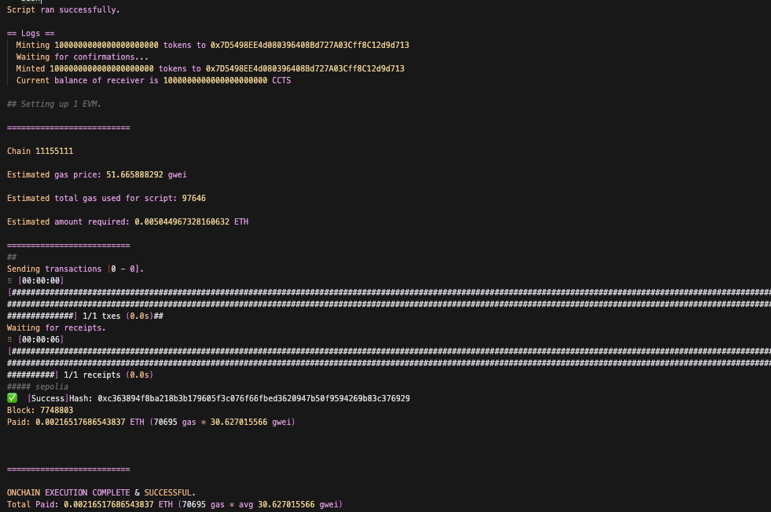

# Step 12 | [Transfer Tokens](./script/transfer/TransferTokens.s.sol)

### 12 | Transfer Tokens | [Ethereum Sepolia](./receipts/transactions/transferEthSepolia.md)
```bash
ETH_SEPOLIA_RPC=$(grep ETH_SEPOLIA_RPC .env | cut -d '=' -f2)
WALLET_ADDRESS=$(grep WALLET_ADDRESS .env | cut -d '=' -f2)
PRIVATE_KEY=$(grep PRIVATE_KEY .env | cut -d '=' -f2)
forge script ./script/transfer/TransferTokens.s.sol:TransferTokens --rpc-url $ETH_SEPOLIA_RPC --broadcast --sender $WALLET_ADDRESS --private-key $PRIVATE_KEY
```
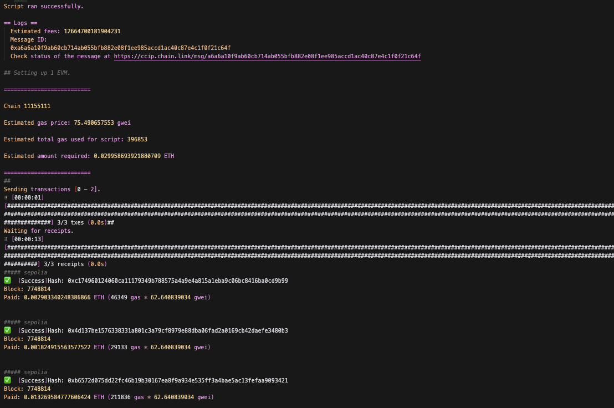
